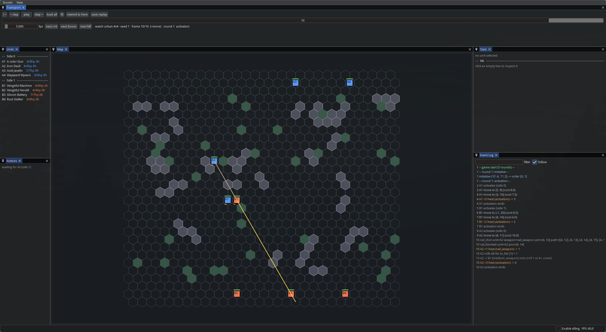

# foosim

Fan tools for the tabletop mech skirmish game *Flames of Orion*: **printable
quick-play unit sheets** you can download and use right away, and **foosim**, a
rules-testing simulator.

## Quick-play unit sheets (print and play)

Don't want to run any code? Use the web generator, or download a pre-rolled sheet, print
it, and play.

### **[Open the sheet generator](https://jrobrien.github.io/flames-of-orion-sim/)**

Pick a seed, how many squads, the frame mix (default 1 Heavy / 2 Medium / 1 Light),
whether the leader gets a perk and whether mechs can carry ammo, then print or save as
PDF. It runs entirely in your browser (no backend); the source is in
[`docs/`](docs/index.html).

Or grab a ready-made file: **[squads.pdf](docs/sheets/squads.pdf)** (64 squads,
64 pages, 5.4 MB).

Plus a one-page [**blank sheet**](docs/sheets/blank.pdf) to fill in by hand (20 heat and
10 HP circles per mech, 8 platform rows); print as many copies as you need.

**What's on them.** The PDF is 64 pages, one *squad* per page, so there are 64 squads
in all. Each squad is four mechs: a **Heavy squad leader** (top), two **Mediums** and a
**Light**. Every mech is rolled on the Black Market tables (weapons d8, upgrades d20, optional
ammo; the frame is fixed by the squad slot) with the prices from the
rulebook, and carries a stat block, a Platforms list with costs, a total cost, and heat /
HP trackers drawn as circles to tick off. Stat boxes marked `*` `†` `‡` `§` `¶` `#` are
changed by a platform or perk; the matching platform line says whether the change is
*already in* the printed number or *can modify* it (e.g. a +1 CS that only applies to
ranged attacks).

**Squad leader perk.** The leader also gets **one random perk** from the optional
Experience table (as if it were the 5 XP Veteran-mode squad leader). It is never a
melee bonus on a mech with no melee weapon, or a ranged bonus on one with no ranged
weapon. The perk is written in the leader's Notes box; stat perks (HEAT Expert,
Hydraulics Overhaul) are already added into HL / S.

**Why 64 squads?** It is for quick action: flip to a page you like, or print a few
pages double-sided and choose from the squads on them. Items are
generated from the *Flames of Orion* **Free Edition (v10.10)** tables and prices, and use
*all* of the rules' gear, including weapons and upgrades this simulator doesn't
implement yet.

> Fan-made and unofficial. Buy the game: <https://underthedice.com/flamesoforion/>.

### Make your own sheets (command line)

`foosim-sheet` (Python) writes the same kind of pages as a self-contained HTML file; open it in a browser
and print (Letter, portrait; "Save as PDF" works too). See [Getting started](#getting-started)
for the one-time `uv sync`.

```bash
uv run foosim-sheet --seed 42 --pages 4 --out mine.html   # 4 squads, reproducible by seed
uv run foosim-sheet --blank --pages 4 --out blank.html     # blank fill-in sheets
uv run foosim-sheet --seed 42 --paper A4 --out a4.html     # A4 instead of Letter
uv run foosim-sheet --seed 42 --supported-only             # only gear the simulator implements
scripts/build_sheets.sh                                     # rebuild docs/sheets/*.pdf (needs Chrome/Chromium)
```

## foosim: the rules-testing simulator

A desktop **rules-testing sandbox** for the tabletop mech skirmish game
*Flames of Orion*. Built to explore and stress-test changes to the combat rules:
play a battle by hand through a hex-grid UI, or run thousands of AI-vs-AI games and
diff the aggregates after a rule tweak.

> ### Play the real game
> *Flames of Orion* is a tabletop miniatures wargame by Stephen Hupfer. This
> project is a fan-made lab for tinkering with its rules — it is **not** a
> substitute for the game. If you enjoy poking at it here, buy the rulebook,
> paint some mechs, and play it on a table:
> **<https://underthedice.com/flamesoforion/>**



*Watching a bot game (`uv run --extra ui foosim-ui`). The yellow line is a Rail
Weapon shot from `A2` raking down the board until an indestructible building stops
it — see the `rail_shot` / `rail_blocked` / `+1 heat` entries in the event log on
the right. Step/play controls are top-left; the unit roster and a per-hex
inspector dock on the sides.*

## Getting started

`foosim` isn't packaged — run it from a source checkout. It uses
[uv](https://docs.astral.sh/uv/) for the environment (Python 3.11+, pinned to
3.12 in `.python-version`).

```bash
# 1. install uv (once)
curl -LsSf https://astral.sh/uv/install.sh | sh

# 2. clone and enter
git clone https://github.com/jrobrien/flames-of-orion-sim.git
cd flames-of-orion-sim

# 3. build the venv + install everything (engine + ui + analysis + dev tools)
uv sync --all-extras

# 4. sanity check
uv run pytest
```

`uv run <cmd>` runs inside the project venv without activating it; `uv sync` keeps
it in lockstep with `uv.lock`. Drop `--all-extras` for just the engine + dev
tools — the `ui` extra adds imgui-bundle, `analysis` adds numpy + pandas. `pytest`
and `ruff` are in the `dev` group and install by default.

### Run it

```bash
uv run --extra ui foosim-ui                     # watch a bot game (the screenshot above)
uv run foosim-autobattle --seed 1              # headless AI vs AI, event log only
uv run foosim-gen-unit --seed 5                # print random mech stat blocks
uv run foosim-sheet --seed 5 --pages 2 --out mechs.html   # printable random squads (see above)
uv run foosim-sheet --blank --pages 4 --out blank.html   # blank fill-in sheets
uv run foosim-analyze                           # help: commands, bots, setups, workflows
uv run foosim-analyze run --games 500           # bulk stats (all CPUs; -j N to limit)
uv run foosim-analyze run --games 500 --matchup greedy-vs-random --setup scatter
uv run foosim-analyze run --games 2000 --db results.sqlite --label baseline  # + per-mech/weapon data
uv run foosim-analyze report weapons --db results.sqlite      # damage / cost-efficiency by weapon
uv run foosim-analyze report frames --db results.sqlite       # light vs medium vs heavy
uv run foosim-analyze run --games 1000 --squad-seed-0 7 --db ctrl.sqlite   # pin side 0's squad
uv run foosim-analyze run --games 1000 --mirror --db mirror.sqlite         # both sides, same squad
uv run foosim-analyze list gear                 # prices, and which items the sim implements
uv run foosim-analyze describe greedy           # what a bot / setup / report / table is
uv run foosim-analyze schema                    # SQLite tables, every column explained
uv run foosim-analyze manifest > manifest.json  # everything as JSON (for scripts / agents)
uv run foosim-analyze run --games 500 --override heat.second_action=2 --baseline base.csv  # A/B a rule
uv run --extra ui foosim-ui --replay tests/data/replays/skirmish_2v2_seed1.json  # scrub a saved game
```

### Bulk analysis: finding the best builds and weapons

`foosim-analyze` runs thousands of AI-vs-AI games in parallel and can store per-mech
builds and per-weapon damage in SQLite for your own analysis. Start with the
[**analysis guide**](docs/analysis-guide.md) (which sim to run, the damage metric, how to
isolate variables with squad seeds, the database schema and example queries); the tool
documents itself too: `foosim-analyze` (overview), `list bots|setups|gear`,
`describe NAME`, `schema`, and `manifest` (everything as JSON, for scripts and agents).

### Play a game yourself

foosim is built for simulation and bulk analysis, but there is a playable mode.
`--play` hands you side 0 against the AI; `--hotseat` drives both sides on one
screen:

```bash
uv run --extra ui foosim-ui --play             # you are side 0 — urban 4v4, generated mechs
uv run --extra ui foosim-ui --play --skirmish  # the small fixed 2v2 board instead
uv run --extra ui foosim-ui --hotseat          # both sides human
```

Pick one of your units in the roster, choose an action in the **Actions** panel
(Move / Ranged / Melee / Disengage / Purge Heat), then click a hex or an enemy
token. The panel previews the to-hit number and expected damage before you
commit, and bolstered variants (run, charge, unleash hell, fury, …) appear as a
toggle on the action. Use the transport bar to step back and forth or save the
game as a replay.

**Status:** early. Design is in [`PLAN.md`](PLAN.md); the mechanics spec the engine
follows is [`RULES.md`](RULES.md). See `PLAN.md §7` for milestones.

## What it will do

- Select a unit, read its stats, choose an action, aim/move it on a 2D hex map
  with polygon-ish obstacles and square tokens. Turn-based.
- **Auto-battle:** headless AI vs AI to completion.
- **Replay & inspect:** scrub any battle, jump to crits / explosions / kills.
- **Bulk analysis:** `run_many` over a seed range, apply `--override` rule
  changes, compare runs.

## Design shape

- `foosim.engine` — pure, deterministic, **stdlib only**. `apply(state, action,
  rng, rules) -> (state, [events])`. Own `splitmix64` PRNG so replays are
  reproducible across languages.
- `foosim.ai` — bot policies (`engine` only).
- `foosim.sim` — run / replay / generate / analyze (`engine` + `ai`).
- `foosim.ui` — imgui-bundle front-end (the only place `imgui_bundle` is imported;
  nothing depends on it).

Rules numbers live in [`data/rules.toml`](data/rules.toml) so rule changes are data
edits, not code edits. The engine boundary is kept clean so the logic can back a
fancier Godot/C# UI later — see `PLAN.md §8`.

## Disclaimer

**Flames of Orion is © 2025 Stephen Hupfer.** This is an unofficial, fan-made
playtesting tool. It contains **no** rulebook text, art, or layout — only a
clean-room reimplementation of game mechanics (which are not copyrightable).
Buy the game: <https://underthedice.com/flamesoforion/>

## License

Code: MIT (see [`LICENSE`](LICENSE)). The *Flames of Orion* game and its rulebook
are the property of their author and are not covered by this license.
